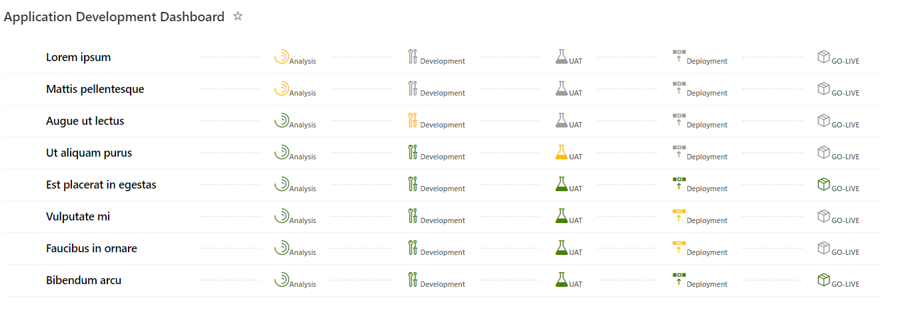

# Application Development Dashboard
-----

## Summary
----

A very simple dashboard to show the current status of the applicaitons.
This is very handy when presenting to the higher managemnet which are not concerned of very deep activities of the applicaiton and needs to just have an overview of all the applications currently team is working on.

*__Note__: `Status field to complete the previous stage before moving on to the next stage`

## Dashboard View

 
## View requirements

Following columns will be required in the list and in the view

| Column Name | Column Type         |
| ----------- | ------------------- |
| Title       | Single line of text |
| Status      | Choice              |

- __Status Field Values__: `Analysis`, `Development`, `UAT` , `Deployment`, `GO-LIVE`

## About

| Version | Date        | Author        |
| ------- | ----------- | ------------- |
| 1.0     | 10 Jan 2022 | Sumit Kanchan |

## Disclaimer

THIS CODE IS PROVIDED AS IS WITHOUT WARRANTY OF ANY KIND, EITHER EXPRESS OR IMPLIED, INCLUDING ANY IMPLIED WARRANTIES OF FITNESS FOR A PARTICULAR PURPOSE, MERCHANTABILITY, OR NON-INFRINGEMENT.
