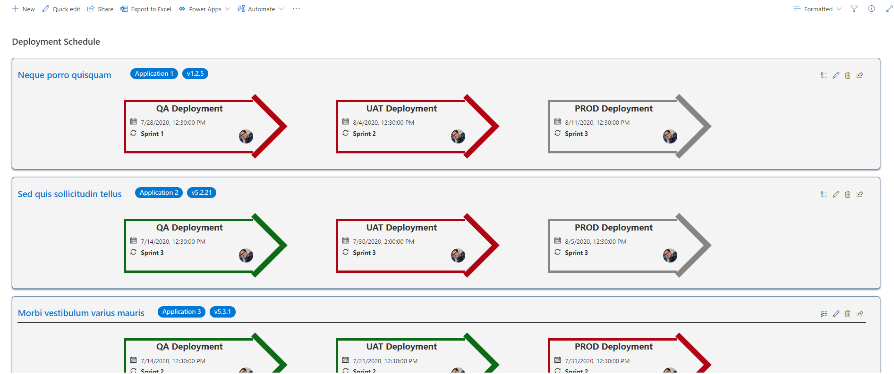
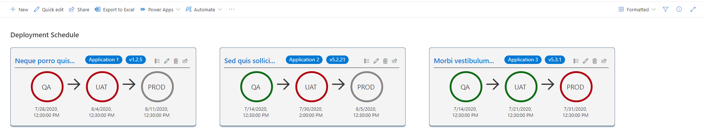

# Deployment Schedule Row formatter
-----

## Summary
----

If you are keeping your deployment schedule in a SharePoint List, than this formatter might help you in having a quick view about the status of the deployment
It has got two views 
- List view which is more detailed view showing more relevant information
- Tile view, which is quick view and shows only the status

## List View

## Tile View

 
## View requirements

Following columns will be required in the list and in the view

| Column Name          | Column Type          |
|----------------------|----------------------|
| Title                | Single line of text  |
| Application          | Choice               |
| PackageVersion       | Single lines of text |
| Status               | Choice               |
| QADeployment         | DateTime             |
| UATDeployment        | DateTime             |
| PRODDeployment       | DateTime             |
| Responsible          | Person               |
| QADeploymentSprint   | Choice               |
| UATDeploymentSprint  | Choice               |
| PRODDeploymentSprint | Choice               |

## Sample

| Version | Date | Author|
|-----|-----|-----|
|1.0|03 Aug 2020 | Sumit Kanchan |

## Disclaimer

THIS CODE IS PROVIDED AS IS WITHOUT WARRANTY OF ANY KIND, EITHER EXPRESS OR IMPLIED, INCLUDING ANY IMPLIED WARRANTIES OF FITNESS FOR A PARTICULAR PURPOSE, MERCHANTABILITY, OR NON-INFRINGEMENT.
