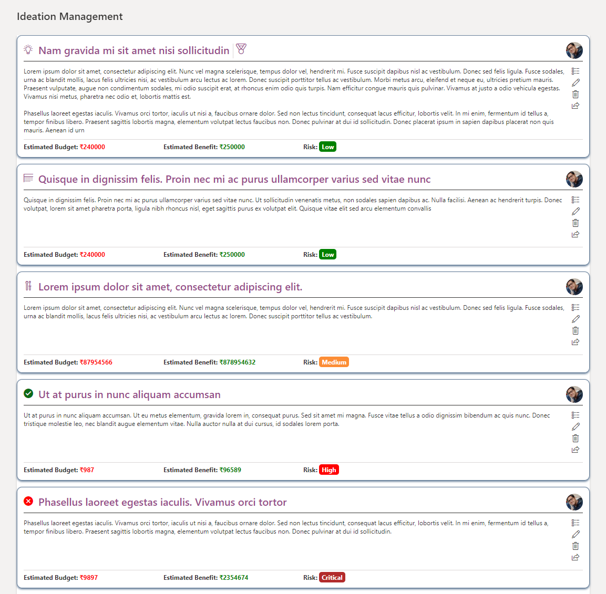

# Ideation Management Row formatter
-----

## Summary
----

This sample is for displaying the interactive view of the ideation management

- Filter by stage of the idea, implementation, completed or rejected
- Assign medal for an outstanding idea
- and much more

## List View

 
## View requirements

Following columns will be required in the list and in the view

| Column Name      | Column Type            |
|------------------|------------------------|
| Title            | Single line of text    |
| Submitter        | Person                 |
| Description      | Multiple lines of text |
| Budget Cost      | Currency               |
| Benefit Estimate | Currency               |
| Risk Rating      | Choice                 |
| PRODDeployment   | DateTime               |
| Stage            | Choice                 |
| Assign Medal     | Yes/No                 |

- Stage Field Values: `Idea`, `Implementation`, `Completed`, `Rejected` 
- Risk Field Values: `Low`, `Medium`, `High`, `Critical` 

## Sample

| Version | Date        | Author        |
|---------|-------------|---------------|
| 1.0     | 06 Aug 2020 | Sumit Kanchan |

## Disclaimer

THIS CODE IS PROVIDED AS IS WITHOUT WARRANTY OF ANY KIND, EITHER EXPRESS OR IMPLIED, INCLUDING ANY IMPLIED WARRANTIES OF FITNESS FOR A PARTICULAR PURPOSE, MERCHANTABILITY, OR NON-INFRINGEMENT.
